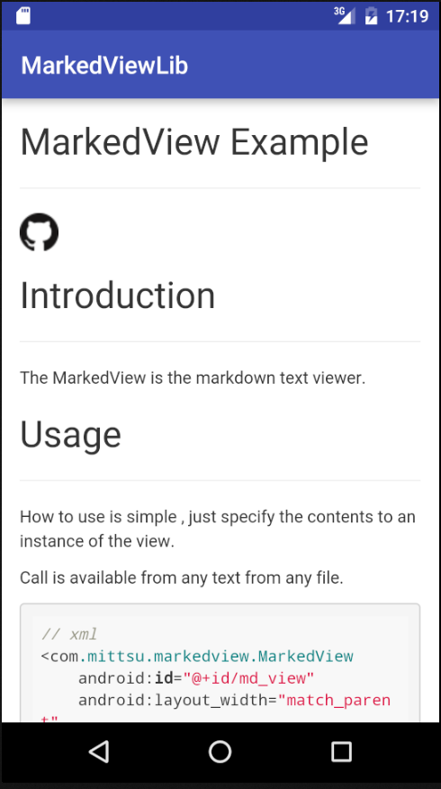

## MarkedView Example

[](https://android-arsenal.com/details/1/3801)





## Introduction


The MarkedView is the markdown text viewer.


## Usage


It is a simple module, which enable you to convert any files into initialized view.


```xml
// xml
<com.mittsu.markedview.MarkedView
    android:id="@+id/md_view"
    android:layout_width="match_parent"
    android:layout_height="match_parent"/>

```


```java
// Java code

import com.mittsu.markedview.MarkedView;

・・・

// call from xml
MarkedView mdView = (MarkedView)findViewById(R.id.md_view);
// call from code
// MarkedView mdView = new MarkedView(this);


// set Markdown text pattern.
// contents is Markdown text.
mdView.setMDText(contents);

// load Markdown file pattern.
// mdView.loadFile(filePath)

```


## Installation


Add the dependency

```gradle
dependencies {
    compile 'com.mittsu:markedview:1.0.0@aar'
}
```

## See Also

* MarkedView-for-iOS  
https://github.com/mittsuu/MarkedView-for-iOS


## License


MarkedView is available under the MIT license. See the LICENSE file for more info.
